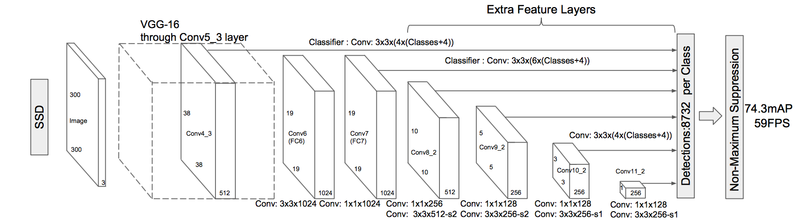

# Project 5: Vehicle Detection Project

---

## Introduction

The goals / steps of this project are the following:

* Implement a vehicle detection pipeline
* Run the pipeline on a video stream and create a heat map of recurring detections frame by frame to reject outliers and follow detected vehicles.
* Estimate a bounding box for vehicles detected.

## Files

* VehicleDetection.ipynb: A jupyter notebook showing each step of vehicle detection for a single image
* ssd.py: Keras implementation of SSD architecture
* ssd_layers.py: Special purpose layers for SSD
* ssd_utils.py: Helper functions for SSD
* lane_vehicle_detection.mp4: The output video of the vehicle detection pipeline (applied on video output of P4)
* README.md: a report writeup file

---

## SSD

For this task instead of using the suggested classic computer vision pipeline with HOG and sliding window search, I decided to use the SSD network which is a state of the art solution for real time object detection. By using the SSD I didn't have to tune parameters for feature extraction, the false positives were removed easily by increasing the prediction confidence threshold and the model was already pre-trained on the 'car' class, so no additional training was required.

### 1. Network Architecture



The SSD approach ([link](https://arxiv.org/pdf/1512.02325.pdf)) is based on a feed-forward convolutional network that produces a fixed-size collection of bounding boxes and scores for the presence of object class instances in those boxes, followed by a non-maximum suppression step to produce the final detections.

The architecture consists of some early network layers which are based on a standard architecture (VGG-16). This architecture is followed by convolutional feature layers which decrease in size progressively and allow predictions of detections at multiple scales. Each added feature layer can produce a fixed set of detection predictions using a set of convolutional filters. For a feature layer, the basic element for predicting parameters of a potential detection is a small kernel that produces either a score for a category, or a shape offset relative to the default box coordinates.

### 2. Model training

The network has been initially trained on the Pascal VOC dataset. Training the network from scratch is a time consuming process, so I loaded the weights of the pre-trained SSD_300 which can be found [here](https://mega.nz/#F!7RowVLCL!q3cEVRK9jyOSB9el3SssIA). The weights were loaded into the Keras model whose implementation can be found in [this repo](https://github.com/rykov8/ssd_keras).

```bash
model = SSD300(input_shape, num_classes=NUM_CLASSES)
model.load_weights('weights_SSD300.hdf5', by_name=True)
```

### 3. Model prediction and post processing

Once the weights of the pre-trained network have been modeled the model prediction is passed to the `detection_out` method of the `BBoxUtility`, which does non maximum suppression on the prediction and returns a list of predictions for every picture in the form `[label, confidence, xmin, ymin, xmax, ymax]`. I then apply a threshold of confidence 60% and keep only the boxes that correspond to label 7 (car).

`top_indices = [i for i, conf in enumerate(det_conf) if conf >= 0.6 and det_label[i]==7]`

For lower values of threshold we can be sure that there won't be any vehicles missed, however that would also increase the number of false positives.

### 4. Results

I integrated the model prediction, prediction processing and bounding box drawing steps into the `img_detect_vehicle` function that forms the vehicle detection pipeline. When applied in 4 test images, for a threshold of 60% confidence, it gives the following results:


### 5. Video Implementation

The `img_detect_vehicle` function was applied on the project video and the result can be found [here](https://youtu.be/UGlXYoA6IXg)

---

### Discussion

**Techniques used**

To solve the vehicle detection problem I used the SSD network architecture
which is a state of the art method for real time detection and tracking, so
it performed very well on this task. In my case the video processing was far from
real time (3sec/frame) however, this was due to running the pipeline on
a CPU and using a batch size of 1. It is also worth noting that by using a
confidence of 60% there were no false positives in the final video.

**Where the pipeline might fail**

The pipeline worked very well on vehicle detection because I used the weights
of a model which was pretrained on the VOC classes and included the car class,
however it would fail on object tracking of a class not in VOC, such as traffic
signs.

**How to improve**

I noticed that in a couple of frames the pipeline missed the car, which resulted
to minor jittering and also the bounding box is quite unstable. I could use some kind of averaging between frames to have a smoother bounding box in the final video.

## Acknowledgements

The Keras implementation of SSD that was used for the vehicle detection in this project, is done by **rykov8** and can be found in [this repo](https://github.com/rykov8/ssd_keras)
